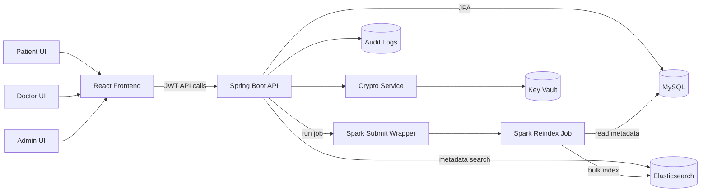

# Architecture

## Overview

This project is a secure hospital records platform with three main surfaces:

- A Spring Boot API that owns authentication, authorization, encrypted records, audit logs and reindex orchestration.
- A React/Vite frontend for admin, doctor and patient workflows.
- A data/search layer using MySQL, Elasticsearch and an optional Apache Spark reindex job.

## System Diagram

## Backend Responsibilities

- Authenticate users and issue JWT tokens.
- Enforce role-based access control for admin, doctor and patient endpoints.
- Store sensitive medical content with AES-GCM encryption.
- Keep searchable metadata separate from encrypted record content.
- Record request-level audit logs for privileged operations.
- Trigger direct or Spark-based Elasticsearch reindexing.

## Frontend Responsibilities

- Provide role-specific dashboards.
- Keep patient-facing views focused on profile and history.
- Provide doctor workflows for search and medical record management.
- Provide admin workflows for users, roles, audit logs, master keys and search reindex status.

## Data Flow

1. A user logs in through `/api/auth/login` and receives a JWT.
2. The frontend sends authenticated API requests with the JWT bearer token.
3. The backend validates role access before reading or mutating data.
4. Sensitive record content is encrypted before persistence.
5. Searchable metadata is indexed into Elasticsearch.
6. Admin users can trigger direct or Spark reindexing when metadata changes need to be rebuilt.

## Security Boundaries

- Raw medical content is not stored in Elasticsearch.
- Real credentials are supplied through environment variables.
- Generated certificates, keystores, logs, dependency folders and build artifacts are excluded from Git.
- Secure deployment mode supports TLS for Elasticsearch, Spark and the backend.
